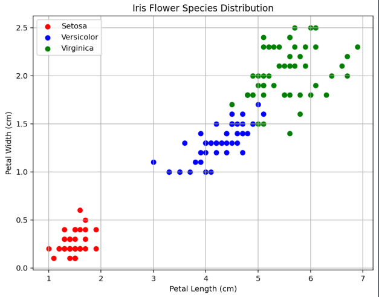
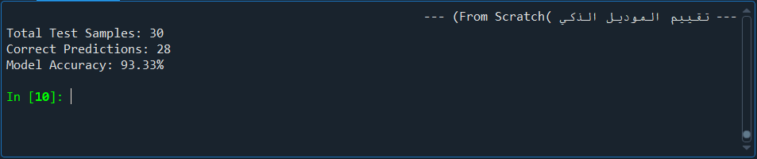

# Iris Flower Classification Model (From Scratch)

This repository contains my submission for **Task 1** during my Data Science Virtual Internship at **CodeAlpha**.

## Project Overview
The goal of this project is to classify Iris flowers into three species (*Setosa*, *Versicolor*, and *Virginica*) based on their petal and sepal measurements. Due to environment constraints, the decision tree classifier was built **entirely from scratch** using rule-based logic without relying on `scikit-learn`.

## Data Visualization
Before training the model, data distribution was analyzed using `matplotlib` to see how different species separate based on Petal dimensions:

## Model Performance
The custom model achieved an outstanding accuracy on the test dataset:

* **Total Test Samples:** 30
* **Correct Predictions:** 28
* **Model Accuracy:** 93.33%

## Environment & Tools
* **IDE:** Spyder
* **Language:** Python 3.11
* **Libraries:** Pandas, NumPy, Matplotlib
